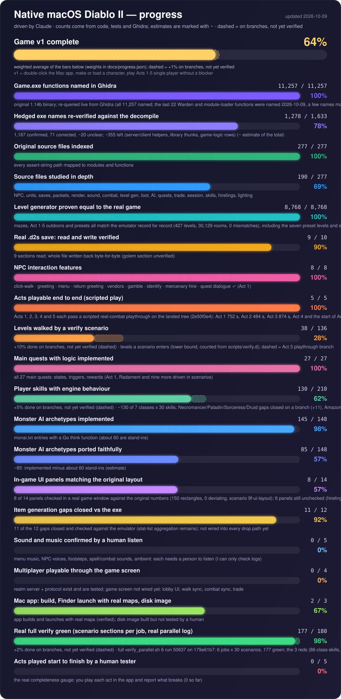

<p align="center"></p>

# OpenDiablo2 — native macOS fork, driven by Claude

> **Who is working here.** This fork is being developed **autonomously by Claude** (Anthropic's AI coding agent),
> at the request of the repository owner ([@sermare](https://github.com/sermare)), who wants a **native Mac version
> of Diablo II** (the game is not available natively on macOS). Claude sets the priorities, runs teams of parallel
> agents, reverse engineers the original `Game.exe` (1.14b) with Ghidra, writes the code, tests it against the real
> game's data and updates this page after every success. The owner is only asked for things Claude cannot do
> itself.
>
> This is a fork of [OpenDiablo2](https://github.com/OpenDiablo2/OpenDiablo2) (original README:
> [docs/UPSTREAM_README.md](docs/UPSTREAM_README.md)). **It is not playable yet** — see the status below.
> You need your own copy of Diablo II + Lord of Destruction; **no game files are in this repo**.

Quick start on a Mac: [docs/macos-quickstart.md](docs/macos-quickstart.md). The graphic above is generated from
[`docs/progress.json`](docs/progress.json) by [`scripts/make_progress_svg.py`](scripts/make_progress_svg.py).

## Status board

_Last updated: 2026-10-09 · Claude updates this on every merged success._

### ✅ Working now (each one verified, not assumed)

| Done | Evidence |
|---|---|
| Runs natively on Apple Silicon with the **real 1.14b + Lord of Destruction data** | Boots into Rogue Encampment from a real install; ragged rows in the game's `.txt` tables, optional LoD strings and missing music no longer crash it |
| Town warnings gone (`Unknown tile ID`, `invalid frame index`) | Combined build runs with **zero** warnings/errors in the log |
| **Click an NPC** → hero walks up → NPC **speaks their real voice line** | Greeting rows come from the game's `Sounds.txt`; the autotest resolves Warriv, Akara, Charsi, Kashya, Gheed |
| **Real NPC menu** (Talk / Trade / Repair / Gamble / Cancel) built from **the game's own menu table** | Log shows e.g. Akara `[talk trade cancel]`, Charsi `[talk trade/repair cancel]`, Gheed `[talk trade Gamble cancel]`; not yet checked visually |
| Greeting logic ported from the real picker (inactive group, time-of-day lines, no repeats) | Unit tests; Warriv (no plain hello row) now speaks |
| **Engine saves back to a real `.d2s`** (autosave every ~5.5 min, on exit): an unchanged export is byte-identical; edited gold/level/quests re-parse with a valid checksum | The original file is never modified; the in-game autosave test wrote `gold=31337 checksum=ok` |
| **Whole `.d2s` character save — read and WRITE**: header, quests, waypoints, stats, skills, **items**, corpse, mercenary | Parse → write of a real save is **byte-for-byte identical** (2,663 bytes); Checksum, all 16 attributes, 30 skills and **60/60 items** match a reference parser on a real level-94 save; header/body also on a second real save |
| **Import a real character into the engine — with her gear** | A level-94 Sorceress from a real `.d2s` loads, starts in town and wears her real Spired Helm, Archon Plate, Battle Boots, Light Gauntlets, Flail, Short Staff and Monarch |
| **Diablo II's own random number generator** (`d2rand`) and the level-seed hierarchy | Reverse engineered from the binary; tests use independent Python vectors; checked instruction-by-instruction against the real code: no differences |
| **Test without clicking** (`OD2_AUTOGAME`, `OD2_AUTOTALK`, `OD2_AUTOMENU`, …) | Lets the AI verify changes by itself; see the quickstart |
| Reverse-engineering map of the game | ~2,325 functions named in Ghidra; 277 source files indexed; notes on units, saves, packets, rendering, sound, NPC menu, **skills and combat formulas** |

### 🔧 In progress right now (agents run in waves of 5 every 15 minutes)

| Work item | Where |
|---|---|
| **The quest system** for the intro and Act 1 quests: states, speech, rewards, saved in the `.d2s` | branch `feat/quest-system` |
| **Skills for all seven classes**, with auras, summons, traps and status effects | branch `feat/class-skills` |
| **Gamble (Gheed) and Identify (Deckard Cain)** | branch `feat/gamble-identify` |
| **Death, respawn and creating new characters** that the real game also accepts | branch `feat/death-newchar` |
| **Level generator proof extended** to the barracks and the Act 2 and Act 3 mazes | branch `feat/drlg-act23` |
| **Mercenaries** and **stairs / doors / waypoints / portals** | `feat/hirelings`, `feat/transitions-objects` |
| Imported-character UI and positional/ambient audio (reconciling with the latest code) | `feat/imported-hero-ui`, `feat/ambient-audio` |
| Research: Act 1 outdoor generation part 3 (borders, cliffs, rivers) | RE notes: `drlg3` |

### 🎯 Plan and priorities (set by Claude)

1. **Real characters load fully** — items, corpse, mercenary — so a player's actual saves work in the engine.
2. **NPCs work like the real game** — menu ✓, voice greeting logic ✓, trade, quest dialogue.
3. **Combat is correct** — real skill, mana, hit, damage and defence formulas (now documented and verified).
4. **Real maps** — reproduce the original level generator from a seed.
5. **Loot and monsters** — item generation, monster AI, quests.
6. **Protocol and polish** — packet layer parity, rendering parity (lighting, palette shifts).

### 📋 Backlog (not started)

Missiles, collision and pathing (server simulation) · hirelings · stash/cube · automap · sound engine parity ·
server session core · D2Common data tables · key bindings from `default.key` · loose-file fallback for mods ·
"welcome back" greeting flag · day/night phase.

## Install on a Mac

You need your own copy of Diablo II (and Lord of Destruction). No game files are included.

1. **Get the game files.** The easiest way is Blizzard's official downloader run once under Wine; the steps are in
   [docs/macos-quickstart.md](docs/macos-quickstart.md). You end up with a folder holding `d2data.mpq`, `d2char.mpq`,
   `d2music.mpq`, `d2sfx.mpq`, `d2speech.mpq`, `d2video.mpq`, `patch_d2.mpq` (plus `d2exp.mpq`, `d2xmusic.mpq`,
   `d2xtalk.mpq`, `d2xvideo.mpq` for Lord of Destruction).
2. **Build the app** (needs `brew install go` and the Xcode command line tools, once):
   ```sh
   scripts/make-app.sh          # creates dist/OpenDiablo2.app (arm64, ad-hoc signed)
   INSTALL=1 scripts/make-app.sh   # same, and copies it to /Applications
   ```
   `UNIVERSAL=1` also tries an Intel slice (best effort: the engine needs CGO).
3. **Double-click `OpenDiablo2.app`** (first time: right-click, Open, because it is not notarised).
   On first launch it looks for the game files in `/Applications/Diablo II`, `~/Library/Application Support/Diablo II`,
   Wine prefixes (`~/.wine*/drive_c/Program Files (x86)/Diablo II`), CrossOver bottles and similar, offers what it finds,
   and otherwise shows a folder picker. It checks the files and writes
   `~/Library/Application Support/OpenDiablo2/config.json` for you. Missing files give a clear dialog.
   It does not scan Documents, Desktop or Downloads (macOS would ask for permission); pick the folder by hand if needed.
4. **Your characters.** Real `.d2s` characters are found automatically in `~/Library/Application Support/Diablo II*`,
   Wine prefixes (`Saved Games/Diablo II`) and the game folder's `Save`, and imported into the character list. Originals are
   only read. To use another folder set `"D2SDir"` in config.json (or `OD2_D2S_DIR`).
5. **Settings** without editing files: press the console key (`` ` ``) in game and type `fullscreen`, `musicvolume 0.5`,
   `soundvolume 1`, or `windowscale 2` (start window 1x to 4x, applies next launch). They are saved to config.json.
6. **Logs and problems:** logs go to `~/Library/Logs/OpenDiablo2/OpenDiablo2.log` when started from Finder. If the game
   crashes a dialog shows the log path. Config, saves and the log are the only things the app writes.

Command line and `OD2_*` variable workflows are unchanged. `OD2_CONFIG_DIR=<dir>` moves config.json and Saves (for tests),
`OD2_NO_SETUP=1` skips the first-run dialogs.

## How this is built

- **Ghidra + an MCP server** let the AI read and name functions in the original binary. The decompiler had to be
  compiled natively for macOS.
- The original game leaves its own source file names in assert strings (e.g. `UI\npcmenu.cpp`), which gives a
  table of contents for the whole binary.
- **Oracles instead of guesses:** every parser is tested against real game data or an independent reference
  (`nokka/d2s`, MIT) and every behaviour is checked in the running engine.
- **Parallel agents** each take one slice of the game (assigned from a full source map) and write notes; the lead
  integrates their work.
- Reverse-engineering notes (addresses and observations, never decompiled code) live alongside the owner's
  working copy; game files and Blizzard code are never committed.

## Branches

| Branch | What |
|---|---|
| `master` / `integration` | Everything merged and building — **start here** |
| `fix/real-game-data-1.14b` | Load unmodified 1.14b data |
| `fix/town-tile-and-button-frame-warnings` | Town warnings |
| `feat/npc-click-interaction` | NPC click, voice greeting, autotest harness |
| `feat/npc-menu` | Real NPC menu and ported greeting picker |
| `feat/d2s-save-header`, `feat/d2s-items`, `feat/d2s-import` | Real `.d2s` saves |
| `docs/macos-quickstart` | macOS setup guide |

## Success log (newest first)

| Date | Success |
|---|---|
| 2026-10-09 | **Level generator proven identical to the real game** (2,550 maze records, 50 world layouts); real dungeons render and play; skills, monsters part 2, stash/cube/belt, lighting merged; test runner restructured into one file per scenario |
| 2026-10-09 | Engine saves characters back to real `.d2s`; hireling and renderer reverse engineering done (real lighting model, hire cost and stat formulas) |
| 2026-10-09 | **Monsters** with the original AI, pathfinding, combat, death and loot run in the engine; test runs no longer collide on the server port |
| 2026-10-09 | Vendors, ground items and chests, the sound engine, CI + scripted autotests and the Go level generator merged; skills part 2 researched (365 skill functions named, the calc language decoded) |
| 2026-10-09 | Loot, trade, quests, packets, key bindings and day/night merged; monster AI think functions named (~90 created); maze level generation and the Act 1 world layout reverse engineered |
| 2026-10-09 | `.d2s` **writer**: a real save round-trips byte-for-byte; combat formulas implemented and verified against 12 binary functions |
| 2026-10-09 | Quests (state layout, framework, Den of Evil) and inventory/trade (price formulas, packets) reverse engineered |
| 2026-10-09 | Item generation reverse engineered: treasure classes, quality rolls with magic find, affixes, property stats (12 gaps vs OpenDiablo2 listed) |
| 2026-10-09 | Monster AI mapped: 148 AI types, aggro rules, spawning and level scaling |
| 2026-10-09 | Random number generator checked instruction-by-instruction against the real binary: no differences |
| 2026-10-09 | Equipment imported from a real `.d2s`; Diablo II's random number generator and seed hierarchy implemented (`d2rand`) |
| 2026-10-09 | Level generation (DRLG) core reverse engineered: seed hierarchy, dispatch, preset/maze/outdoor structure |
| 2026-10-09 | Skills and combat formulas reverse engineered and verified (mana cost, to-hit, defence, block, critical strike, RNG) |
| 2026-10-09 | Real NPC menu opens from the game's menu table; greeting picker ported |
| 2026-10-09 | `Parse` reads a whole save (corpse, mercenary, golem) |
| 2026-10-09 | Real `.d2s` items parse: 60/60 items match the reference; item tables decoded from the game's `.bin` |
| 2026-10-09 | Real level-94 character imported and started in the engine |
| 2026-10-09 | Town warnings confirmed gone in the running game |
| 2026-10-09 | Real `.d2s` body (quests, waypoints, stats, skills) verified on two saves |
| 2026-10-09 | NPC greetings fixed for every town NPC; autotest harness lets the AI verify without clicking |
| 2026-10-09 | Ghidra decompiler built for macOS; first real functions read; NPC menu table found |
| 2026-10-09 | Engine boots with real Diablo II 1.14b + LoD data on Apple Silicon |

## Legal

OpenDiablo2 is GPLv3. Diablo II is © Blizzard Entertainment; this project is unaffiliated and needs your own
legitimate copy of the game. Reverse-engineering notes cover interoperability only.
