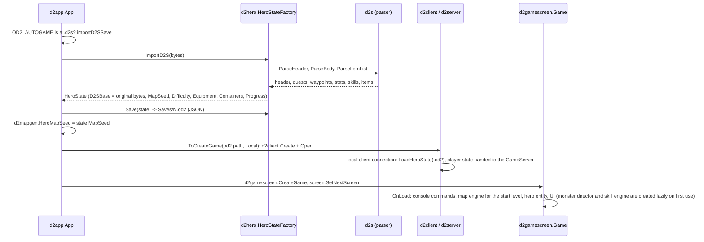
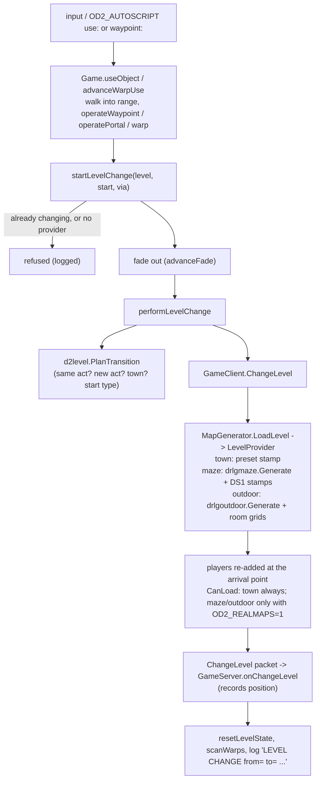
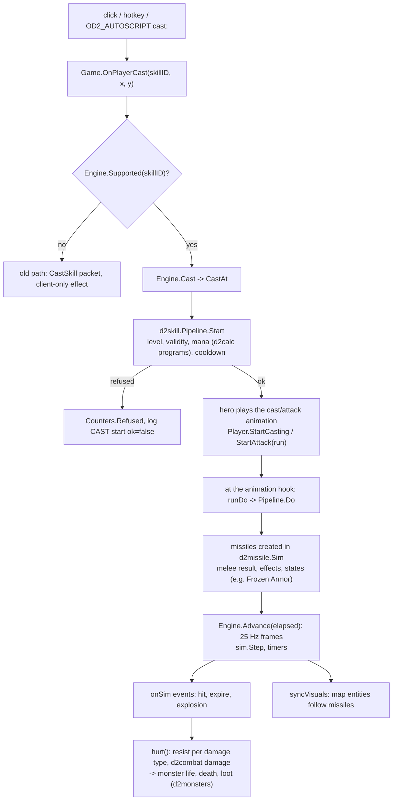
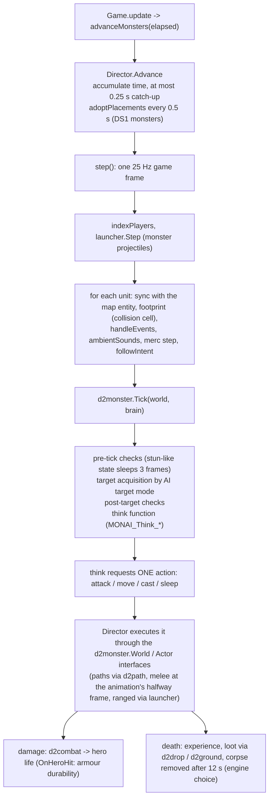
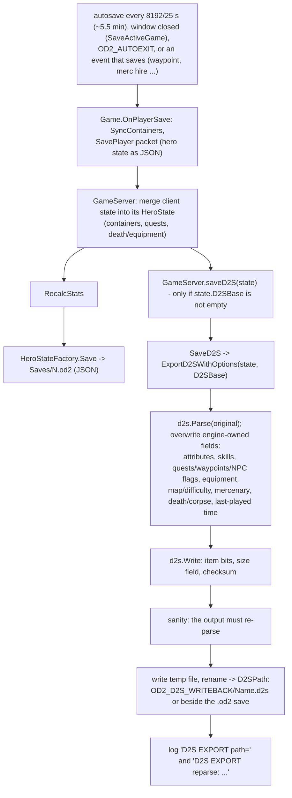
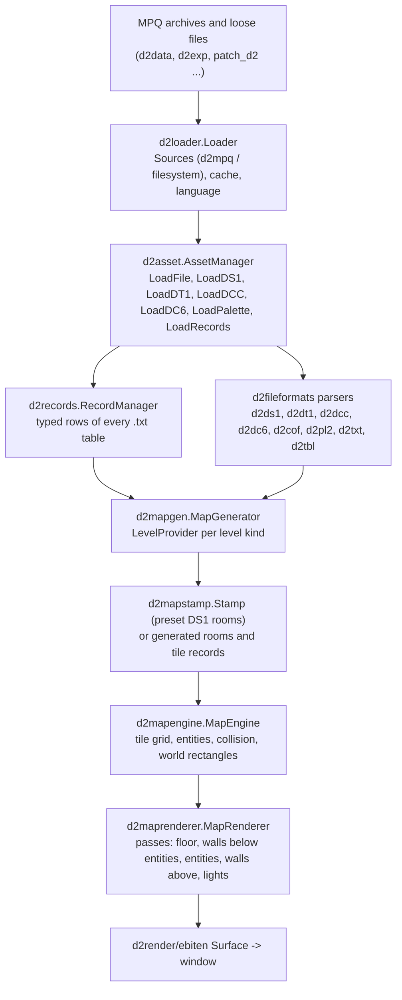
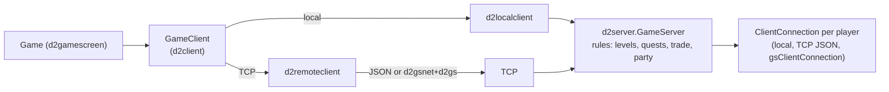
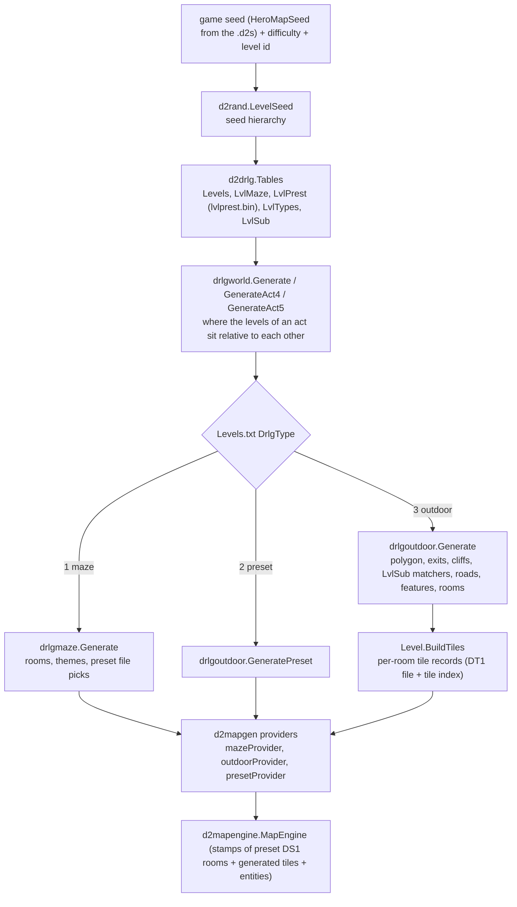

# Architecture

A map of the code as it stands on the `integration` branch of this fork. Read it with
[TESTING.md](TESTING.md) (how things are checked) and [REVERSE_ENGINEERING.md](REVERSE_ENGINEERING.md)
(where the facts come from). The status board in the [README](../README.md) is the authority on what
works today; this page explains how the code is laid out.

The engine is Go, built on [Ebiten](https://ebiten.org/) for rendering, input and audio. The fork keeps the
upstream OpenDiablo2 skeleton (asset manager, record manager, map engine, UI, screens) and adds a layer of
**pure packages** that reproduce original-game rules, each ported from reverse-engineered notes about
`Game.exe` 1.14b and wired into the engine through thin glue packages.

## 1. The layering rule

```
 main.go / bundle_*.go            entry point, macOS .app bundle helpers
        |
   d2app                          application shell: boot, config, first run, screens, autotest hooks
        |
   d2game  (d2gamescreen, d2player, d2autoscript)
        |                         screens and the in-game UI; per-frame glue between UI, engine and rules
   d2networking                   client/server (local loopback or TCP/UDP), JSON packets, d2gs wire format
        |
   d2core                         engine: assets, records, map engine/renderer, heroes, monsters, skills,
        |                         vendors, items, audio, UI widgets, config
   d2common                       PURE packages: file formats and original-game rules; no display,
                                  no MPQ access in the rule packages, runnable on Linux CI
```

The rule that makes the fork testable: **a rule package in `d2common` (or the pure parts of `d2core`) never
imports the engine.** It receives its inputs as plain numbers, small interfaces or parsed table structs, and a
random source (anything with `Roll(n)`, typically `*d2rand.Seed`). A `d2core` glue package then adapts engine
objects to those interfaces. This is why `go test` can check most rules without a game install, a GPU or a window.

Dependencies point downwards. `d2common` is imported by everything and imports nothing above itself, with one upstream
exception (`d2interface/navigate.go` imports the tiny `d2clientconnectiontype` package from `d2networking`).

### 1.1 Who calls whom (summary)

| Caller | Calls (main edges) |
|---|---|
| `main` | `d2app` (and `d2setup` through it) |
| `d2app.App` | `d2asset`, `d2config`, `d2input`, `d2audio`, `d2screen`, `d2gui`, `d2term`, `d2gamescreen`, `d2hero` (import/export), `d2mapgen` (seed) |
| `d2gamescreen.Game` | `d2client` (all server traffic), `d2mapengine` + `d2maprenderer`, `d2monsters`, `d2skills`, `d2player` (UI), `d2autoscript`, `d2quest`, `d2boss`, `d2level`, `d2audio` |
| `d2player` panels | `d2inventory`, `d2item`, `d2vendor`, `d2trade`, `d2equip`, `d2statlist`, `d2party`, `d2ui` widgets |
| `d2server.GameServer` | `d2netpacket`, `d2hero` (saves), `d2level`, `d2party`, `d2playertrade`, `d2gsnet` (option), connections |
| `d2monsters` | `d2monster`, `d2combat`, `d2path`, `d2drop`, `d2ground`, `d2difficulty`, `d2sfx` |
| `d2skills` | `d2skill`, `d2missile`, `d2state`, `d2calc`, `d2combat`, `d2path` |
| `d2mapgen` | `d2drlg/*`, `d2level`, `d2mapstamp`, `d2mapengine`, `d2asset`, `d2rand` |
| `d2hero` | `d2s`, `d2statlist`, `d2equip`, `d2inventory`, `d2difficulty` |
| pure packages | other pure packages and `d2rand`; never the engine |

## 2. Package catalogue

"Status" uses the vocabulary of [REVERSE_ENGINEERING.md](REVERSE_ENGINEERING.md):

* **oracle-verified**: compared to the real game, either through the emulator ground truth or a real save/real data;
* **binary-read**: control flow and constants read from the decompiled binary, covered by unit tests, but not compared
  to the running original; individual points may be tagged `UNVERIFIED` in the package's comments;
* **engine/upstream**: upstream OpenDiablo2 code, only changed where noted.

Package comments in the code are the detailed source of truth for each `VERIFIED` / `UNVERIFIED` tag.

### 2.1 `d2common`: file formats and infrastructure

| Package | Purpose | Status |
|---|---|---|
| `d2fileformats/*` (`d2mpq`, `d2dc6`, `d2dcc`, `d2ds1`, `d2dt1`, `d2cof`, `d2animdata`, `d2pl2`, `d2tbl`, `d2txt`, `d2font`, `d2dat`) | Parsers for the original archive and asset formats. `d2txt` reads the `.txt` data tables; `d2ds1` the preset map files. | engine/upstream, extended for 1.14b real data (ragged table rows, optional LoD strings) |
| `d2fileformats/d2s` | Diablo II character save (`.d2s`, version 0x60): `ParseHeader`, `ParseBody`, `Parse`, `Write`. Header, quests, waypoints, NPC flags, stats, skills, items (bit reader/writer), corpse, mercenary, golem; `newchar.go` builds a new-character file. Item layout needs `ItemTables` built from the game's compiled `.bin` tables. | oracle-verified: unchanged parse-to-write is byte-identical on a real save; items match an independent reference parser (60/60) on a real level-94 save. Note: the package comment in `doc.go` still says "header only" and is stale. |
| `d2fileformats/d2key` | `default.key` (key binding) parser, 57 records of 20 bytes. | oracle-verified layout against the real 1146-byte file; two flag fields are `unverified` |
| `d2loader`, `d2cache`, `d2resource`, `d2interface`, `d2enum`, `d2geom`, `d2util`, `d2data`, `d2datautils` | Asset sources (MPQ and filesystem), generic cache, resource paths, engine interfaces, enums, helpers. | engine/upstream |
| `d2math`, `d2math/d2vector` | Vector and range helpers (upstream). | engine/upstream |
| `d2math/d2rand` | Diablo II's own random number generator (64-bit state, multiply-with-carry step) and the seed hierarchy the level generator derives from the game seed (`DrlgBaseSeed` and friends). Everything stochastic in the pure packages goes through it. | oracle-verified: checked instruction by instruction against the binary, and used to reproduce real maps exactly |
| `d2calculation`, `d2calculation/d2lexer`, `d2calculation/d2parser` | Upstream expression parser used by the old skill code. | engine/upstream (superseded by `d2calc` for the new skill pipeline) |

### 2.2 `d2common`: original-game rules (pure)

| Package | Purpose and key types | Original subsystem | Status |
|---|---|---|---|
| `d2drlg` | Table interfaces (`Levels`, `LvlMaze`, `LvlPrest`, `LvlTypes`, `LvlSub`), `Tables`, `Difficulty`, `DrawActExtras`. Root of the level generator (DRLG). | `DRLG_CreateDrlg` and level generation (D2Common) | see sub-packages |
| `d2drlg/drlgworld` | Act 1 world layout: where Rogue Encampment, the wilderness levels, Burial Grounds and the Monastery cluster sit relative to each other (randomised depth-first search). | `DRLG_PlaceOutdoorLevelsInWorld` | oracle-verified on 50 seeds; two details inside cluster validation are marked `UNVERIFIED` in the code |
| `d2drlg/drlgmaze` | Maze levels (Levels.txt DrlgType 1): Act 1 caves, crypts, jail, catacombs; Act 2 sewers, tombs, lairs, Arcane Sanctuary; Act 3 dungeons and Durance of Hate; Act 4/5 maze types (`maze_act45.go`). Reproduces the level-seed draw order, theme pass and DS1 gates. | maze generator in the DRLG | oracle-verified for the Act 1, Act 2/3 and Act 4/5 maze goldens committed in `d2drlg/testdata` (see TESTING.md for exact coverage and caveats) |
| `d2drlg/drlgoutdoor` | Act 1 outdoor generator: boundary polygon, exits, cliffs, LvlSub border matchers, caves, town transitions, road network, waypoint/shrine sites, per-level features, cell-to-room pass, 9x9 room tile grids (`BuildRoomGrids`). Levels 2-7, 17 (0x11), 39 (0x27) only. | `DRLG_GenerateAct1Outdoors`, `DRLG_CreateOutdoorRooms` | oracle-verified for rooms and the tile grids; the DT1 tile pick is modelled as exactly one room-seed step (`PickTile`), and the per-cell tile records are not ported. Acts 2-5 outdoors: not implemented (research notes only) |
| `d2level` | Level ids, acts, the level graph (exits), waypoints and their save-file bits, portals, cooldowns, arrival start types, `PlanTransition`. | `SERVER_ChangePlayerLevel` | binary-read; arrival rules partly `UNVERIFIED` |
| `d2combat` | Combat math as pure functions: to-hit, defence, block, critical strike, damage, mana cost; `Roller` interface satisfied by `*d2rand.Seed`. | skills/combat formulas | binary-read; the README records 12 binary functions checked. "inferred" items are tagged in doc comments |
| `d2calc` | The `skills.txt` / `missiles.txt` calculation language: compiler to reverse polish, evaluation against an `Env`. | calc compiler of Game.exe | binary-read; four details (rand modulus, sklvl argument order, ...) are `unverified` |
| `d2skill` | Server-side skill cast pipeline: `Registry`, `Skill`, `Pipeline.Start` (validity, mana, cooldown) and `Pipeline.Do` (missiles, melee, effects, states), `Unit`/`Target` interfaces. Implemented: generic missile skills (Fire Bolt, Ice Bolt, Magic/Fire/Cold Arrow), Charged Bolt, Attack/Kick/Bash/Stun/Jab, Throw, Frozen Armor, Static Field, Inner Sight, Howl, Warmth. | `SKILL_ServerRunStartFunc` / `SKILL_ServerRunSkillFunc` | binary-read, limited coverage (other classes' skills are research or in progress on feature branches) |
| `d2missile` | Missile simulation: creation from a missiles.txt row, standard move, collision along the path, hit/expire, pierce, sub-missiles; `World` interface for map/units/damage. | `MISSILE_SrvDoStandardMove`, `MISSILE_ProcessHitOrExpire` | binary-read; homing, special do-functions and area hit functions are not modelled (listed in the package comment) |
| `d2path` | Per-subtile collision flag grid and the click-to-move pathfinder (straight line, then short 8-neighbour A* with costs 2/3). | collision and path type 7 | binary-read; mask choices marked `UNVERIFIED` |
| `d2monster` | Monster AI framework: `Brain` (per-unit RNG, command queue, leader/minions), `Tick` envelope, 20+ think functions (Skeleton, Zombie, Goatman, Fallen, ranged archers/mages, Andariel, Smith, Griswold, Blood Raven ...), spawn rules from monstats. Senses/Actor/World are interfaces. | `MONAI_*` | binary-read; the package comment lists the AIs not ported (Summoner, Vulture, Duriel and bosses, forced flee/fear/charm states) |
| `d2statlist` | Stat lists: sums of item properties, derivations (vitality to life, dexterity to defence and attack rating, resist caps, block). 8.8 fixed point for life/mana/stamina. | stat lists, `itemstatcost` | binary-read; unverified points tagged |
| `d2equip` | Which item fits which body location, requirement formula, weapon sets, armour piece durability loss, effect of a broken piece. | `INV_CheckItemRequirements` and neighbours | binary-read, requirement formula and durability tables `VERIFIED` |
| `d2trade` | Buy, sell, gamble, repair and identify price formulas in 32-bit integer maths (1/1024 fixed point). | `TRADE_CalcItemPrice`, `TRADE_CalcGamblePrice` | binary-read |
| `d2quest` | Quest state machine: nodes, events fed in by the engine, the 16 flag bits of the `.d2s` quest record, effects reported to the engine. Act 1 quests and Radament's Lair; later quests have no node. | quest framework | binary-read for message tables; handlers follow a clean-room reference and are checked against the binary notes only for some quests (see package comment) |
| `d2object` | Rules of world objects other than doors/waypoints/portals: operate-function table, shrine effects and durations, wells. | object operate functions | binary-read; most details beyond the dispatcher `UNVERIFIED` |
| `d2hireling` | Mercenary model: `hireling.txt`, hire offers, stats per level, skill choice, experience, revive cost. | `hirelings` slice | binary-read |
| `d2automap` | Automap table (`automap.bin`), tile-to-cell lookup, isometric projection, reveal model. | `UI\automap.cpp` | binary-read, mostly `VERIFIED` |
| `d2daynight` | Global day/night clock: phase 0..5, ticks per degree, ambient intensity and colour table. | `Env.cpp` | binary-read; the colour blend and phase advance are `UNVERIFIED` |

More pure packages that were added after the first catalogue (all in `d2common`, all display-free):

| Package | Purpose and key types | Status |
|---|---|---|
| `d2state` | Timed states, auras and damage over time that skills put on units: a `Set` per unit of `Instance`s and poison/burn streams, plus query methods (slow, can act, resists, damage percent). Frames are 25 Hz. | binary-read; poison total matches the tooltip arithmetic (`TestPoisonTotalMatchesTooltip`); stacking and slow percents `UNVERIFIED` |
| `d2difficulty` | Normal / Nightmare / Hell: `DifficultyLevels.txt` rows, monster stat scaling from `monlvl.txt`, resist and experience penalties, drop and unlock rules. | scaling formula and table rows read from the real tables and binary; the header progression byte is `UNVERIFIED` |
| `d2boss` | `Manager`: trigger logic of the Duriel, Mephisto, Diablo and Baal encounters. Takes facts in, returns `Action`s. | ids and the Baal wave cycle binary-read; delays, positions and portal objects `UNVERIFIED` |
| `d2party` | `Roster`: players, parties, invitations, hostility, experience split; the server owns one and broadcasts `Snapshot`s. | party list and same-level sharing binary-read; invitation flow `UNVERIFIED` |

`d2networking/d2gs` implements the real game's packet framing as a pure library (id and size tables, encoder/decoder,
Huffman coder, blob framing, `Tunnel`). **It is wired in as an option**: `d2networking/d2gsnet` translates the engine's
`d2netpacket` packets to and from d2gs packets, and `d2server` (`gs_connection.go`) and `d2remoteclient` use it when
`OD2_PROTO=d2gs` is set on both sides. The JSON encoding of `d2netpacket` stays the default. See section 3.7.

### 2.3 `d2core`: the engine

| Package | Purpose | Notes |
|---|---|---|
| `d2asset` | `AssetManager`: loads MPQs/loose files through `d2loader`, owns the `Records` (`d2records.RecordManager`), animations, fonts, palettes. | upstream, extended for 1.14b data |
| `d2records` | Typed records for every game `.txt` table (about 170 files). Skills are exposed for the new pipeline via `SkillTable`. | upstream, extended |
| `d2config`, `d2term`, `d2gui`, `d2ui`, `d2input`, `d2screen`, `d2render/ebiten` | Config (macOS config dir via `OD2_CONFIG_DIR`), in-game terminal, GUI manager, widgets, input, screen manager, Ebiten renderer. | upstream |
| `d2hero` | `HeroState` (the engine's hero record, saved as JSON `.od2`), `HeroStateFactory`; `.d2s` import (`ImportD2S`), export (`ExportD2S*`, `SaveD2S`), new characters, death and corpse rules (`death.go`), containers (inventory/stash/cube/belt), equipment bridge, stat recalculation. | oracle-verified for the save round trip (see Section 3.5); death rules have `UNVERIFIED` points listed in `death.go` |
| `d2inventory`, `d2stats`, `d2stats/diablo2stats`, `d2item`, `d2item/diablo2item` | Inventory grid and slots, stat and item abstractions, Diablo II item implementation (affix and property handling). | upstream, extended |
| `d2item/d2drop` | Loot: treasure class resolution, quality roll from ItemRatio.txt, affix selection. Table-driven through small interfaces. | binary-read; each function's comment lists `UNVERIFIED` parts |
| `d2item/d2ground` | Where drops land, chest treasure classes, gold amounts. | pure |
| `d2vendor` | Town vendor stock generation (10x10 `OccupancyGrid`), gamble stock, restock. | binary-read (`TRADE_GenerateVendorStock`) |
| `d2monsters` | Engine glue for hostile monsters and mercenaries: builds `d2monster` brains from monstats, implements `d2monster.World`, resolves attacks with `d2combat`, applies hero damage, rolls loot with `d2drop`, plays monster sounds. `Director` owns the 25 Hz loop. | simplifications listed in the package comment (hero defence is dexterity/4 only at the time of writing, no champion/unique modifiers, no forced AI states) |
| `d2skills` | Engine glue for the skill pipeline: hero as a `d2skill.Unit`, monsters as missile targets, map flags as collision grid, drawing entities that follow missiles. `Engine.Cast`, `Engine.Advance`. | simplifications listed in the package comment (local only, no mana regeneration, no stun/freeze simulation) |
| `d2map/d2mapengine`, `d2mapentity`, `d2mapstamp`, `d2maprenderer`, `d2lightmap` | Map engine and entities (player, monster, NPC, object, item, missile), preset stamps from DS1, isometric renderer, the real 48x48 sub-tile light map. | engine/upstream, light map binary-read |
| `d2map/d2mapgen` | `MapGenerator` with a list of `LevelProvider`s. Town provider (Rogue Encampment) is always installed. With `OD2_REALMAPS=1` the maze provider (levels 2..37 that generate) and the outdoor provider (2-7, 17, 39) are added; they run `drlgmaze` / `drlgoutdoor` from the hero's map seed (`HeroMapSeed`), stamp DS1 rooms, place DS1 monsters and choose an arrival point. | glue; correctness of the layout comes from the DRLG packages |
| `d2playertrade` | Player-to-player trade: the `Session` both players negotiate (request, offers, accept, cancel) and `Commit`, which moves items and gold between two heroes' containers atomically. Owned by the server. | modelled on visible behaviour (`PlrTrade.cpp` not analysed): `UNVERIFIED` |
| `d2audio`, `d2audio/d2sfx`, `d2audio/ebiten` | Sound engine and the pure voice-allocation model (`d2sfx.Bank`); positional sound; ambient and music. | `d2sfx` binary-read |

### 2.4 `d2game`, `d2networking`, `d2app`

| Package | Purpose |
|---|---|
| `d2game/d2gamescreen` | Screens (Blizzard intro, main menu, character select, **`Game`**), and the Game's per-frame glue: `level_change.go` (fade, portals, waypoints, doors), `game_monsters.go`, `game_skills.go`, `game_merc.go`, `game_death.go`, `ground_items.go`, `objects_operate.go`, `quests*.go`, `lighting.go`, `autosave.go`, sound and ambient. Also the `auto*.go` files that implement the in-game test scenarios (see TESTING.md). |
| `d2game/d2player` | The player UI: panels (inventory, stash, cube, belt, character, skill tree, quest log, waypoint, trade, automap, hotkeys), `GameControls`, equip rules in the UI. |
| `d2game/d2autoscript` | Display-free parser and state machine for `OD2_AUTOSCRIPT` (`move:`, `cast:`, `use:`, `expect:` ...). The game provides a `Host`. |
| `d2networking` | Client and server. `d2server.GameServer` runs even for a local game; `d2localclient` talks to it in-process, `d2remoteclient` over TCP/UDP. `d2netpacket` defines the JSON packets (`SavePlayer`, `ChangeLevel`, `SetWaypoint`, `CastSkill`, `MovePlayer`, ...). `d2gs` is the unwired real wire format (above). |
| `d2app` | `App`: boot sequence, config, MPQ loading, screen transitions (`ToMainMenu`, `ToCreateGame`), console commands, capture, the environment-driven entry points (`OD2_AUTOGAME`, `OD2_AUTONEWCHAR`, `OD2_AUTOSHOT`, `OD2_AUTOPERF`), and `d2setup` (first-run discovery of the game folder and real saves, native dialogs behind a UI interface). |
| `d2script`, `d2thread` | Upstream JS scripting VM and main-thread helper. |

## 3. Data flows

All flows below were traced in the code on `integration`. Names in backticks are real functions.

### 3.1 Starting a game from a `.d2s`

Both the menu path (character list shows imported saves) and `OD2_AUTOGAME=<file.d2s>` end at the same place.



* The `.d2s` is only read. The engine's own save (`.od2`, JSON) lives under the config dir `Saves/`
  (`OD2_CONFIG_DIR` moves it).
* `HeroState.D2SBase` keeps the original bytes so a later export can preserve everything the engine does not model.
* A brand-new character (header only, no body) keeps class defaults from `charstats.txt`.
* The hero's `MapSeed` from the header becomes the seed for every level the generator builds.

### 3.2 A level change (waypoint, portal, stairs)



* `d2level.PlanTransition` is pure and mirrors the original's single decision function. Rebuilding the destination
  uses the same game seed, so a level is identical every visit.
* If the new level fails to build the game goes back to the old level (`performLevelChange` fallback).
* Waypoint travel prefers an arrival next to the destination's waypoint object (`nextToWaypoint`; the original's
  special arrival start type is `UNVERIFIED`).
* Waypoint activation is a server action: `SetWaypoint` packet, then the hero is saved (and written back to a `.d2s`).

### 3.3 A skill cast



* Mana is paid at start or at do time depending on the skill's server start function (`payAtStart` in `d2skill`).
* Only the skills listed in section 2.2 for `d2skill` run through this path; everything else keeps the legacy client
  effect. The engine glue casts locally: no packet is sent for pipeline skills, so remote players would not see them.

### 3.4 A monster tick



* Each monster has its own seed derived from the game seed and its id, and every roll advances it once, in the
  original order (the pure package documents that `&&` short-circuits skip rolls, as in the original).
* The envelope order is `VERIFIED` in the notes; details such as which unit-blocking mask the original uses and the
  corpse lifetime are marked `UNVERIFIED` in the code.

### 3.5 A save export (autosave, exit, waypoint, quest change)



* Export starts from the **original bytes**, so unknown header bytes, items the engine does not touch and unmodelled
  quest bits survive. With an unchanged hero the output equals the original byte for byte (a verified test).
* The input `.d2s` is never modified: the export goes to a different path (writeback dir, or next to the `.od2` file
  with the hero's name).
* Item bits are never fabricated: a character with no items in its file gets none written.

### 3.6 From MPQ to screen

How a byte in an archive becomes a pixel, for one tile of a level:



* `d2loader` opens the archives in priority order (`patch_d2` over `d2exp` over `d2data`) and caches decoded files.
* `d2asset.AssetManager` is the single door the engine uses to ask for files; it also builds the `RecordManager`
  (typed rows of `Levels.txt`, `monstats.txt`, `skills.txt`, ... about 170 tables) at start-up.
* `d2mapgen` picks a `LevelProvider` for a level id (section 3.8). The town provider stamps preset DS1 files; the real
  generators produce a room list and tile records and then use the same tile and stamp machinery.
* `Game.Advance` (in `d2gamescreen`) steps the map engine, monsters, skills and UI each frame; `Game.Render` draws the map
  renderer first, then the UI on top.
* The renderer is the upstream isometric renderer with a 48x48 light map (`d2lightmap`) and the day/night tint (`d2daynight`)
  added; its output is not compared with the original's pixels.

### 3.7 The networking layers

Three layers, each swappable:

1. **Packet model** (`d2netpacket`): engine-level packets (`AddPlayer`, `MovePlayer`, `CastSkill`, `ChangeLevel`,
   `SetWaypoint`, `Chat`, party and trade packets in `packet_social.go`, ...). They are plain structs with a JSON body and a
   `NetPacketType`.
2. **Transport / connection** (`d2server.ClientConnection`, `d2client.ServerConnection`): a local client talks to the
   `GameServer` in-process (`d2localclient`); a remote client uses TCP (`d2remoteclient`, `d2tcpclientconnection`). A UDP
   connection type exists from upstream but nothing imports it. `GameServer` runs for every game, local or hosted
   (`OD2_HOST=1`, `OD2_JOIN=host:port`, `OD2_BIND`, `OD2_PORT`).
3. **Encoding**: JSON by default. With `OD2_PROTO=d2gs`, `d2gsnet.ServerSide.Encode` / `ClientSide.Encode` turn engine
   packets into real game packets (join 0x68, walk and run, skill select and cast, chat, leave, unit movement, ...) using
   `d2gs`, and everything with no real counterpart (the hero's state, saves, waypoints, party and trade) rides inside a
   tunnel in the variable-length meta packets. The receiving side skips packets it does not understand by their size.
   On the wire the packets are Huffman compressed and length prefixed (`d2gs.EncodeBlob`).



What is verified: the size tables and the framing of `d2gs` (read from the binary and pinned by tests), the layouts of walk,
run and skill packets. What is not: the join layout, the client to server blob framing, and every tunnelled message.
The server and the engine's game rules are shared by the single-player and multiplayer paths, so a rule is tested once.

### 3.8 The level generator (DRLG) pipeline



* `d2drlg` is only interfaces and tables; the generators are `drlgworld`, `drlgmaze`, `drlgoutdoor`. They take tables and a
  seed and return numbers (rectangles, room lists, grids, tile records). They draw random numbers in exactly the order of
  the original; a missing or extra draw changes the final level seed, which is what the oracle goldens check
  (TESTING.md section 3).
* `d2mapgen` (`provider.go`) holds the `LevelProvider` list: `actTownProvider` and `townProvider` always, and with
  `OD2_REALMAPS=1` also `mazeProvider`, `outdoorProvider` and `presetProvider`. Providers registered later are asked first.
  `real_maze_gen.go`, `real_outdoor_gen.go` and `real_town_gen.go` convert generator output into engine tiles and entities
  (DS1 objects and monsters are stamped from the preset files).
* `d2level.PlanTransition` decides which act has to be (re)built when a hero changes level; the same seed makes a level
  identical on every visit.
* Not ported: level 134 (Forgotten Sands, the Act 2 desert generator branch). The DT1 library is not emulated by the
  oracle, so the random tile pick is a documented model.

### 3.9 The monster / skill / combat loop in one picture

Sections 3.3 and 3.4 give each half. Together, one 25 Hz frame in `Game.Advance` is:

1. `gameClient.Drain` applies packets from the server; `MapEngine.Advance` moves entities.
2. `advanceMonsters`: the `Director` ticks every monster's `d2monster.Brain` (think function, one requested action) and
   executes actions through the `World` / `Actor` interfaces, using `d2path` for movement and `d2combat` for hits.
3. `advanceSkills`: the skill `Engine` advances `d2missile.Sim`, expires `d2state` instances, and applies hits through the
   same `hurt` path monsters use (resists, `d2combat` damage, life, death, loot via `d2drop` / `d2ground`, experience,
   quest and boss events).
4. Hero life, mana, level-ups, death (`advanceDeath`) and autosave follow. Everything random draws from seeds derived from the
   game seed, so a run with the same inputs repeats.

## 4. Where to look when changing something

| Change | Start in | Also touch / check |
|---|---|---|
| A table-driven rule (price, damage, durability, drop) | the pure package in `d2common` or `d2core/d2item/d2drop` | its `_test.go`; keep `VERIFIED` / `UNVERIFIED` tags honest |
| Monster behaviour | `d2common/d2monster` (add think function and `register`) | `d2core/d2monsters` only if a new World capability is needed; add a `scripts/verify.d` scenario |
| A new skill | `d2common/d2skill` (implemented-by-function switch), `d2core/d2skills` | missile support in `d2missile` |
| A level generator change | `d2common/d2drlg/*` | the golden JSON in `d2drlg/testdata`; never change a draw order without re-running the oracle (TESTING.md) |
| The `.d2s` format | `d2common/d2fileformats/d2s` | `d2core/d2hero/d2s_*` (import/export), real-save tests |
| UI panel | `d2game/d2player` | an `OD2_AUTOPANEL` / autoscript step if it should be testable |
| A new test hook (env var) | the owning `d2game/d2gamescreen/auto*.go` or `d2app` | document it in TESTING.md and add a `verify.d` scenario |

## 5. Known structural debts

* `d2networking/d2gs` / `d2gsnet` carry only a subset natively; the hero state and social features ride in a tunnel,
  and JSON remains the default encoding.
* Several `d2game` files carry both gameplay glue and `OD2_AUTO*` scenario code; the scenarios are intentionally
  kept next to the code they exercise.
* `go vet ./...` over the whole tree reports older findings (CI vets only the pure packages), and only the packages
  in `GOFMT_DIRS` are gofmt-checked; older upstream files are deliberately left as they are.
